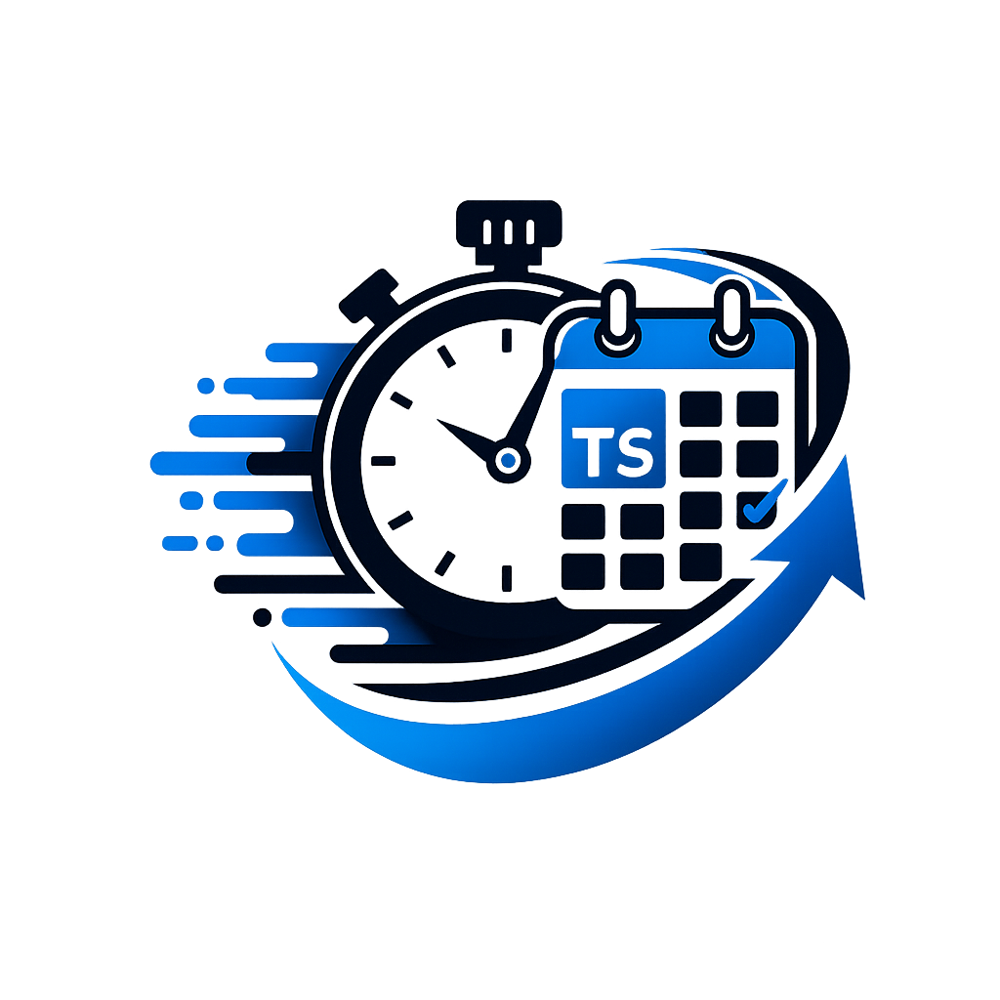

<div align="center">

# Type Scheduler UI



**A SPA interface for managing Type scheduler scheduled tasks, proxies, and more**


[]
[•]
[Deployment](#-deployment)
[•]
[Development](#-development)
[•]
[Contributing](#-contributing)

</div>

---

## 📖 Overview

Type Scheduler UI is a modern React-based web application that provides a clean, intuitive interface for managing the [Backend component](https://github.com/moda20/TypeSchedulerBackend). It enables seamless management of tasks, authentication, proxies, databases, and other system configurations.

### Key Features

- **Multi-Server Support**: Connect and manage multiple backend instances through a single UI using localStorage for server configuration
- **Task Management**: Create, monitor, and control scheduled jobs with detailed execution history
- **Proxy Management**: Configure and manage proxy servers for task execution
- **Database Management**: Handle database connections and configurations
- **Event Logging**: View detailed execution logs and event streams
- **Event handlers**: Send events via notification services based on regex message matching and job duration changes
- **Real-time Updates**: WebSocket integration for live status updates

---

## ✨ Features

| Feature                 | Description                                                             |
| ----------------------- | ----------------------------------------------------------------------- |
| **Authentication**      | Secure login and session management for backend servers                 |
| **Task Management**     | Full CRUD operations for scheduled jobs with cron expressions           |
| **Proxy Configuration** | Add, edit, and manage proxy servers                                     |
| **Database Management** | Manage database connections and settings                                |
| **Event Monitoring**    | Real-time event logs, execution history, and conditional event handling |
| **File Preview**        | Built-in file viewer for job artifacts and outputs                      |
| **Logging**             | Built-in job log viewers                                                |
| **Dashboard**           | Visual overview of system status and task performance                   |

---

## 🚀 Deployment

### Docker (Recommended)

The recommended deployment method uses Docker with nginx as a reverse proxy.

```bash
# Using Docker Compose
docker compose up

# Or run the container directly
docker run -p 80:80 ghcr.io/moda20/type_scheduler_ui:latest
```

### Environment Variables

The following environment variable can be set at build time:

| Variable          | Description                               | Default |
| ----------------- | ----------------------------------------- | ------- |
| `SERVER_ENDPOINT` | The default endpoint of the target server | `/`     |

### Example Docker Compose

A `compose.yml` file is included in the repository for reference. The recommended setup is to deploy the UI alongside an instance of the scheduler backend (see the [starter repo](#)).

---

## 🛠 Development

### Tech Stack

- **Framework**: React 19 + Vite
- **State Management**: Redux Toolkit + React Redux
- **Routing**: React Router v7
- **UI Components**: shadcn/ui (Radix UI primitives) + Tailwind CSS + framer motion
- **Testing**: Vitest + React Testing Library
- **Language**: TypeScript

### Getting Started

```bash
# Clone the repository
git clone https://github.com/moda20/TypeSchedulerUI.git

# Navigate to the project directory
cd TypeSchedulerUI

# Install dependencies
npm install

# Start the development server
npm start

# Build for production
npm run build
```

### Project Structure

```
src/
├── app/              # Redux slices and store configuration
├── assets/           # Static assets (fonts, etc.)
├── components/       # React components
│   ├── custom/       # Custom business logic components
│   └── ui/           # shadcn/ui components
├── features/         # Feature modules (auth, dashboard, jobs, etc.)
├── hooks/            # Custom React hooks
├── lib/              # Utility libraries
├── models/           # TypeScript interfaces and types
├── router/           # Routing configuration
├── services/         # API services
└── styles/           # Global styles and SCSS
```

### Configuration

The application is self-contained and doesn't require additional configuration. All backend connections can be configured through the UI interface.

---

## 📝 License

TBD

---

## 🤝 Contributing

Contributions are welcome! Please follow these guidelines:

1. **Fork the repository** and create a feature branch
2. **Make your changes** following the existing code style
3. **Test thoroughly** - debug issues and ensure functionality
4. **Add tests** for new features when applicable
5. **Commit** with clear, descriptive messages
6. **Push** to your branch and create a pull request

Please ensure your pull requests:

- Pass all linting checks (`npm run lint`)
- Pass all tests (`npm test`)
- Follow the project's code style

---

## 📞 Support

For issues, questions, or suggestions, please open an issue on GitHub.

---

<div align="center">

**Built with ❤️ using React, TypeScript, and shadcn/ui**

</div>
